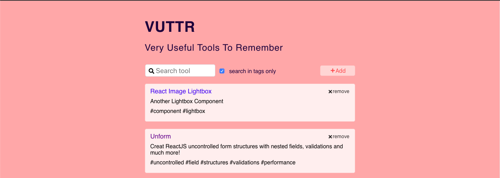
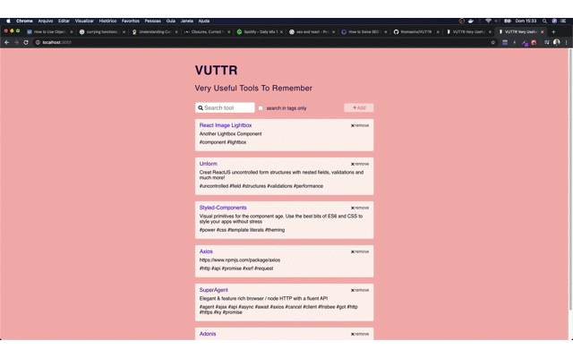
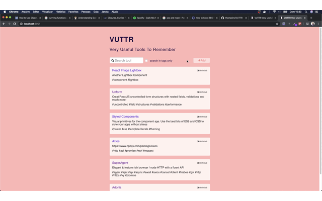

# VUTTR - Very Useful Tools to Remember

  

 
 

 
 

# :memo: Description

VUTTR - stands Very Useful Tools to Remember and is a little react app for managment of develpment tools. As such tools that every developer has to have in your toolset. Such application was developed as requeriment for BossaBox's application process and although simple your porpose was to show the candidate skills. I hope you enjoy because was made as best as i could since my skills keep growning up.

# ⚙️ Applied Libraries and Technologies

- ReactJS;
- Axios;
- Styled-Components;
- React-Icons;
- React-Highlight-Words;
- ESlint;
- Prettier;
- React-Helmet for SEO;
- Kaffeine for the app do not to sleep;
- JSON-Server;
- Deployed with Netlify for front-end and Heroku for a fake back-end using JSON-Server;

# :wrench: How to Install

**You'll need have installed the yarn and JSON-server on your computer before you clone the repository**

**Then proceed to install project dependencies**

- FrontEnd

`https://github.com/thomaslnx/VUTTR.git`

**OBS:** To run locally please uncomment the line 4 and comment line 5 from api.js file located in services directory.

**Inside project's directory, type:** `yarn`

- BackEnd File

`https://github.com/thomaslnx/vuttrfakebackend.git`

**Inside project's directory, type:** `json-server db-1575461292063.json`

# :computer: Try Live

Feel free to try the live sample of vuttr app hosted on Netlify: https://thomaslnx-vuttr.netlify.app/

Made with :heartbeat: by [Marcos Moura](https://github.com/thomaslnx)
